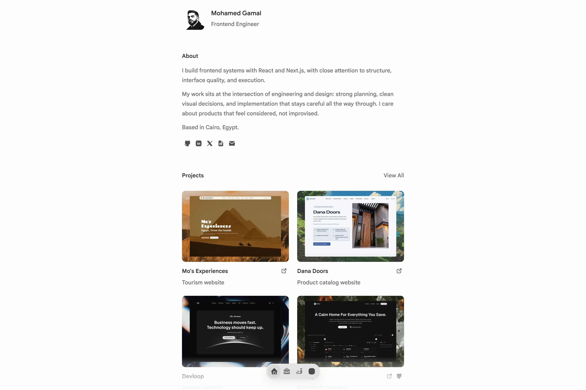

# Personal Portfolio



A personal portfolio and writing site for Mohamed Gamal, built as a calm, narrow, editorial surface for identity, selected work, writing, and contact.

The goal is simple: make intent legible quickly. The site should explain who Mohamed is, what kind of frontend work he does, and where to go next without turning the interface into a performance.

## What This Project Is

This repository powers a real content-driven website, not a landing-page experiment or a component showcase.

It brings together:

- a homepage with a clear editorial spine
- a projects archive and dedicated project pages
- a writing archive and MDX-backed writing pages
- shared metadata, schema, discovery, and Open Graph support
- a small set of reusable interface primitives for layout, motion, and navigation

The site is designed to stay minimal without feeling empty, and structured without feeling heavy.

## Project DNA

Several rules shape almost every decision in the codebase:

- communicate intent within a few seconds of view
- prefer progressive disclosure over showing everything at once
- keep text as the primary interface
- use shared systems before one-off styling
- make the site easy to extend without making it abstract

That means the visual language stays restrained: narrow measure, compact lists, quiet hierarchy, subtle dividers, and motion that supports state and navigation rather than competing for attention.

## Content Model

The project treats content as part of the product surface, not as filler around the UI.

- Projects live as MDX documents under [`content/projects`](./content/projects).
- Writing lives as MDX documents under [`content/writing`](./content/writing).
- Shared content helpers live under [`lib/content`](./lib/content).
- Metadata and structured data helpers live under [`lib/metadata`](./lib/metadata).

This setup keeps authored content, route metadata, and discovery surfaces close enough to stay consistent.

## Stack

- Next.js 16 App Router
- React 19
- TypeScript 5
- Tailwind CSS 4
- pnpm
- Fumadocs MDX for the content pipeline
- Base UI and coss-style primitives for accessible UI building blocks
- Motion for transitions and scene choreography

## Structure

High-level layout of the repository:

- [`app`](./app) for routes and route-level rendering
- [`components`](./components) for reusable UI and page primitives
- [`content`](./content) for project and writing MDX documents
- [`lib`](./lib) for content, metadata, navigation, design, and audio helpers
- [`public`](./public) for static assets
- [`spec`](./spec) for project specs, session logs, and internal planning

## Running Locally

```bash
pnpm install
pnpm dev
```

Useful commands:

```bash
pnpm typecheck
pnpm build
pnpm lint
pnpm doctor
```

## Working Style

This codebase favors explicit structure over cleverness.

- Content and metadata should come from shared sources where possible.
- UI fixes should happen at the system level, not as isolated page overrides.
- Route behavior should stay fast, static where practical, and easy to reason about.
- “Done” only counts when verification is real and uncertainty is named.

## Current Direction

The site already includes the core homepage, projects, writing, metadata, discovery files, and writing/project detail routes. Ongoing work is focused on better authored content, richer media, stronger discovery surfaces, and continued polish without losing the restraint that gives the site its identity.
