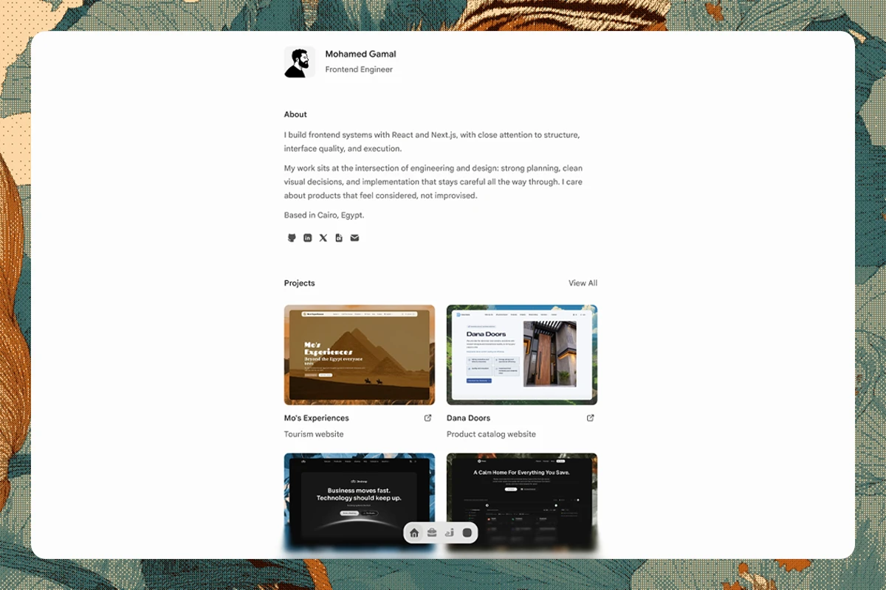

# Mohamed Gamal Portfolio



This is my personal portfolio and writing site. It is meant to be quiet, fast to scan, and specific about the kind of frontend work I care about: React, Next.js, interface quality, content structure, and the small decisions that make a product feel considered.

The site is not trying to be a flashy landing page. It gives visitors a quick read on who I am, what I have built, what I write about, and how to reach me.

## What Is Here

- A homepage with short sections for identity, selected work, writing, approach, and contact.
- A projects archive with dedicated MDX project pages.
- A writing archive with MDX-backed posts.
- Route metadata, JSON-LD, sitemap, robots, manifest, and Open Graph images.
- `llms.txt` and `llms-full.txt` routes for agent-readable site context.
- A floating dock, shared article chrome, page actions, and small motion details.

## Content

Most of the public-facing content lives in a few predictable places:

- Project pages: [`content/projects`](./content/projects)
- Writing posts: [`content/writing`](./content/writing)
- Homepage copy and discovery records: [`lib/content`](./lib/content)
- Metadata and structured data: [`lib/metadata`](./lib/metadata)
- Static images and icons: [`public`](./public)

Projects and writing are authored once, then reused across routes, metadata, discovery files, and share/export actions where it makes sense.

## Stack

- Next.js 16 App Router
- React 19
- TypeScript 5
- Tailwind CSS 4
- Fumadocs MDX
- Base UI, coss-style primitives, and a few small local UI systems
- Motion for page and interface transitions
- pnpm

## Local Work

```bash
pnpm install
pnpm dev
```

Useful checks:

```bash
pnpm format:check
pnpm lint
pnpm typecheck
pnpm build
```

## Project Shape

- [`app`](./app) owns routes, generated files, and route-level metadata.
- [`components`](./components) owns reusable interface pieces.
- [`content`](./content) owns MDX-authored projects and writing.
- [`lib`](./lib) owns content loading, metadata, navigation, motion, design tokens, and audio helpers.
- [`spec`](./spec) keeps project direction, session notes, handoffs, and skill indexing.

## Working Notes

The project is intentionally restrained. Text should carry the interface. Motion should explain state or navigation, not decorate every moment. UI fixes should usually happen in shared surfaces, `app/globals.css`, or `components/ui/*` rather than one-off page overrides.

For agent work, start with [`spec/index.md`](./spec/index.md), then read the newest session file in [`spec/sessions`](./spec/sessions). Use [`spec/skills.md`](./spec/skills.md) only when a skill trigger appears.
