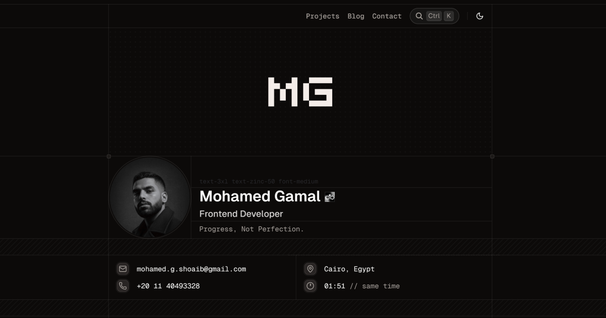

# [Personal Portfolio](https://mohamedgshoaib.me)

A minimal, pixel-perfect dev portfolio and blog to showcase my work as a Frontend Developer.

→ Check out the live portfolio: [mohamedgshoaib.me](https://mohamedgshoaib.me)

[](https://mohamedgshoaib.me)

→ Credit to [Chanh Dai](https://chanhdai.com) for the amazing template.

## Overview

### Stack

- Next.js 16
- Tailwind CSS v4
- shadcn/ui

### Featured

- Clean and modern design
- Light and dark themes
- SEO optimized with JSON-LD schema, sitemap, and robots.txt
- AI-ready with [/llms.txt](https://llmstxt.org)
- Spam-protected email
- Installable as PWA
- Analytics with [PostHog](https://posthog.com)
- Integrated contact form
- Visual project grid

### Blog

- Supports MDX and Markdown
- Raw `.mdx` endpoints for AI readability
- Syntax highlighting for code presentation
- Dynamic OG images for rich link previews
- RSS feed for content distribution

### Analytics

User behavior tracking with [PostHog](https://posthog.com) to understand visitor interaction:

- **Copy events**: Track code and command copies
- **Engagement**: Monitor name pronunciation plays and command menu usage
- **Search behavior**: Analyze search queries
- **User actions**: Navigation, theme changes, and content interactions
- **Screen views**: Automatic page view tracking

Built with privacy:

- Production-only tracking
- Type-safe event schema with Zod

## Development

This guide provides instructions on how to set up and run the project locally.

### Prerequisites

Ensure you have the following installed:

- [Node.js](https://nodejs.org/) (Latest LTS version recommended)
- [pnpm](https://pnpm.io/)
- [Git](https://git-scm.com/)

### Setup

1. Clone the repository

```bash
git clone https://github.com/mohamed-g-shoaib/personal-portfolio.git
cd personal-portfolio
```

2. Install dependencies

```bash
pnpm i
```

3. Configure environment variables

Create a `.env.local` file based on `.env.example`:

```bash
cp .env.example .env.local
```

Then, update the necessary environment variables inside `.env.local`.

4. Run the development server

```bash
pnpm dev
```

The application is available at http://localhost:1408

### Building for Production

```bash
pnpm build
```

After building, start the application with:

```bash
NODE_ENV=production pnpm start
```

## License

Licensed under the [MIT license](./LICENSE).

You are free to use this code. Please remove all personal information before publishing your website.

## Acknowledgments

- [React](https://react.dev)
- [Next.js](https://nextjs.org)
- [Tailwind CSS](https://tailwindcss.com)
- [Radix UI](https://www.radix-ui.com)
- [Base UI](https://base-ui.com)
- [Motion](https://motion.dev)
- [shadcn/ui](https://ui.shadcn.com)
- [Aceternity UI](https://ui.aceternity.com)
- [Kibo UI](https://www.kibo-ui.com)
- [Lucide](https://lucide.dev)
- [Fumadocs](https://fumadocs.dev)
- [PostHog](https://posthog.com)
- And many other open-source libraries used in `package.json`
